# Описание телеграм бота и его функций
## Начало работы
Для начала работы нужно всего лишь нажать кнопку `start`. Далее бот поприветствует вас и предложит вам выполнить команду `help`, чтобы вы могли ознакомиться с функциями бота. Всего у бота есть шесть команд:
- `/start` - начало работы;
- `/set_profile` - настройка профиля;
- `/log_water` - учет выпитой воды;
- `/log_food` - учет потребленных калорий;
- `/log_workout` - учет потраченных калорий;
- `/check_progress` - показ текущего прогресса.

## Настройка профиля

Для того, чтобы настроить свой профиль необходимо ввести или нажать на команду `/set_profile`. Далее пользователю будет необходимо заполнить следующие данные о себе:

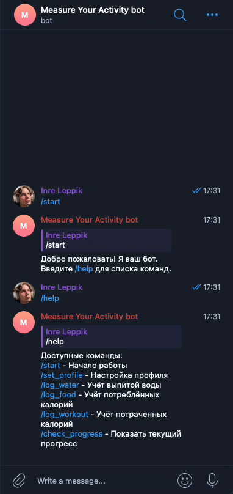
### Пол
На выбор дается мужской или женский

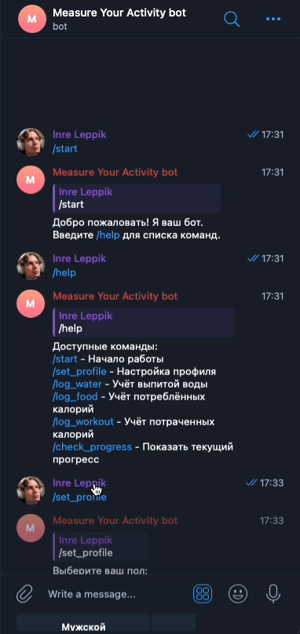

### Вес
Необходимо ввести свой вес в килограммах в целых чилсах

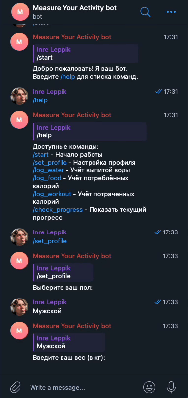

### Рост
Необходимо ввести свой рост в сантиметрах

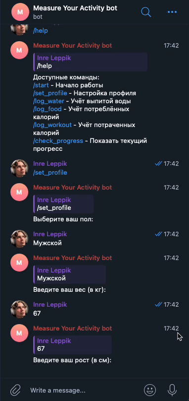

### Возраст
Необходимо ввести свой возраст в годах

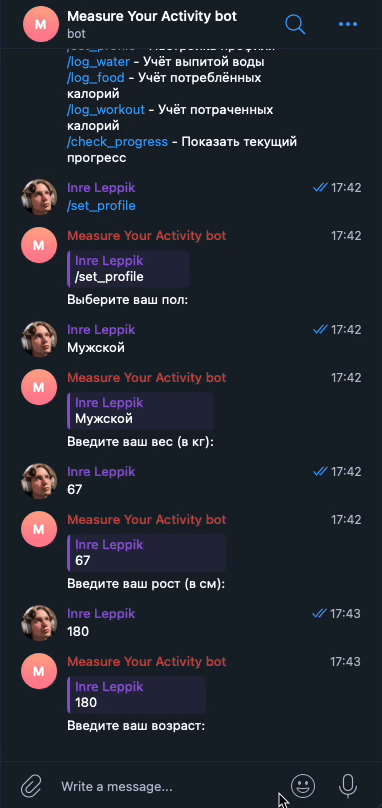

### Уровень активности

Необходимо выбрать подходящий уровень активности среди следующих:

- 1-2 - сидячий образ жизни;
- 3-4 - легкая нагрузка 1-3 раза в неделю;
- 5-6 - умеренные тренировки 3-5 раз в неделю;
- 7-8 - интенсивные тренировки 6-7 раз в неделю;
- 9-10 - тяжелая физическая нагрузка или профессиональные занятия спортом.

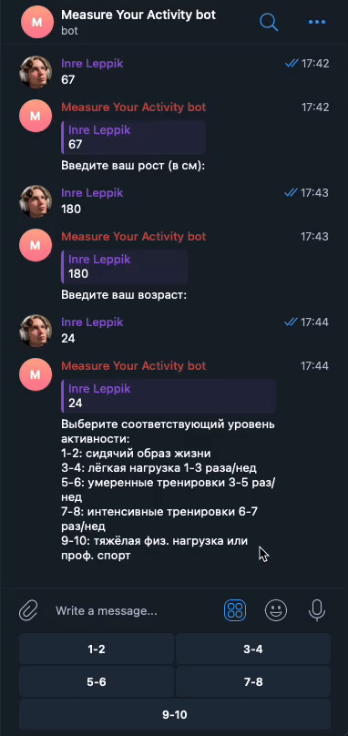

Изначально предполагалось, что пользователь будет вводить среднее количество минут активности в день. Однако это показалось не особо эффективным решением, так как непонятно как это учитывать в рассчете калорий. Поэтому было решено использовать уровень активности исходя из которого значение базовой формулы будет умножаться на определенный коэффициент, так как в зависимости от уровня активности метаболизм у людей разный.

### Город

Необходимо ввести свой город проживания на русском языке

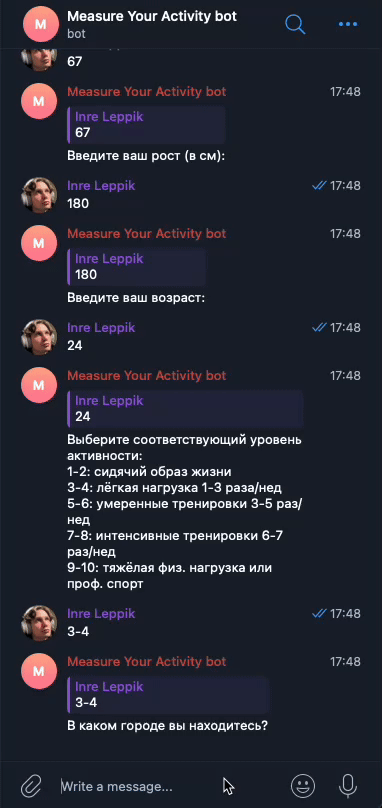

Изначально было необходимо вводить свой город на английском языке, так как этот пункт нужен для того, чтобы узнать температуру в городе пользователя с помощью **OpenWeatherMap API**. Однако благодаря **Yandex Translate API** удалось наладить корректный ввод города на русском. Температура в городе нужна, чтобы определить норму потребления воды пользователя, где:

- температура < 25 градусов - базовая норма;
- температура > 25 градусов - базовая норма + 500 мл;
- температура > 30 градусов - базовая норма + 1000 мл.

### Завершение настройки профиля

В случае успешной настройки, пользователю будет показана информация, которую он ввел, а также его нормы потребления воды и калорий. В противном случае будет необходимо заново ввести команду `/set_profile`.

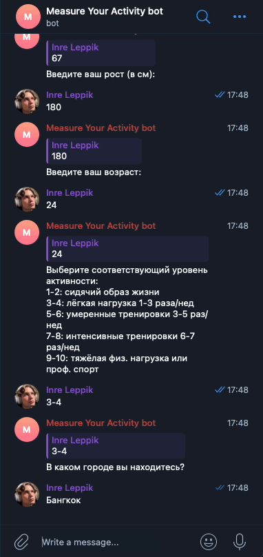

## Учет выпитой воды

Для того, чтобы учесть выпитое количество воды, пользователю необходимо ввести команду `/log_water`. Далее бот предложит пользователю ввести в милилитрах количество выпитой воды. После этого бот выдаст информацию о количестве выпитой воды сейчас и за день, а также количество милилитров оставшихся до цели на день.

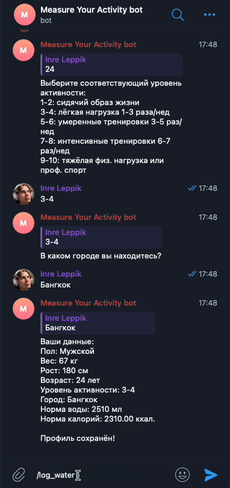

## Учет потребленных калорий

Чтобы пользователь мог учесть потребленные им калории за день, ему необходимо ввести команду `/log_food`. Затем бот предложит ввести название употребленного продукта на русском. После ввода бот покажет калорийность продукта на 100 грамм и попросит ввести потребленное количество в случае, если продукт был найден в базе. В случае, если продукт был не найден, необходимо ввести команду заново и ввести корректное название продукта. После ввода бот покажет статистику по количеству съеденного продукта, его калорийности и количеству потребленных калорий за день.

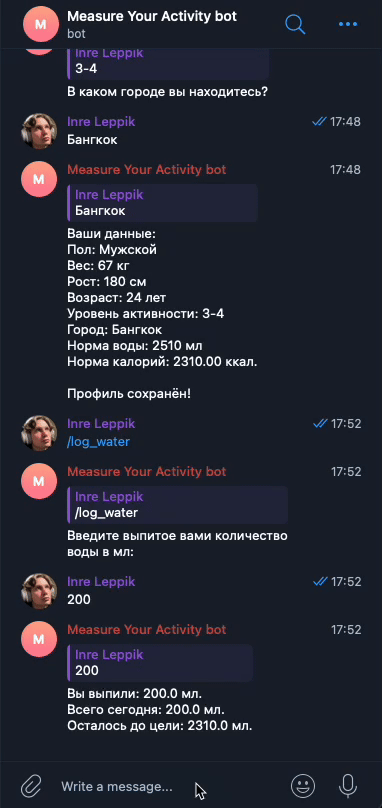

Калорийность продуктов находится с помощью **CalorieNinjas API**. Ввод на русском реализован с помощью **Yandex Translate API**.

## Учет потраченных калорий

Для учета потраченных посредством тренировок калорий пользователю необходимо ввести команду `/log_workout`. Далее бот предложит выбрать пользователю тип тренировки, которую он выполнял из следующего списка:

- бег;
- ходьба;
- велоспорт;
- плаванье;
- йога;
- кардио (фитнес);
- танцы;
- силовая;

Далее бот спросит количество времени, которое пользователь посвятил своему типу тренировки. После этого бот выведет статистику по типу тренировки, количеству времени, количеству калорий, которые сжег пользователь, а также дополнительно попросит выпить воды в зависимоти от количества времени потраченного на тренировку.

## Текущий прогресс

В случае, если пользователь хочет узнать свой текущий прогресс по потреблению и тренировкам ему необходимо ввести команду `/check_progress`. После ее ввода бот выведет следующую информацию:

- количество выпитой воды
- количество, которое необходимо выпить до выполнения нормы
- количество потребленных калорий
- количество сожженных калорий
- баланс калорий

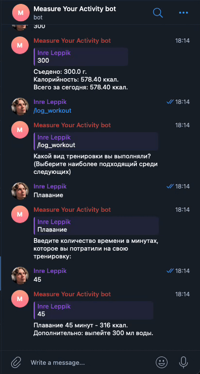

(Увидел во время записи опечатку в коде, вместо оставшейся воды в статистику выводились калории. Уже было сделано исправление)

## Деплой бота

Бот был задеплоен бесплатно на платформе Render.com. Поэтому на текущий момент руками его не потрогать, но для демонстрации в файл были включены gif файлы.

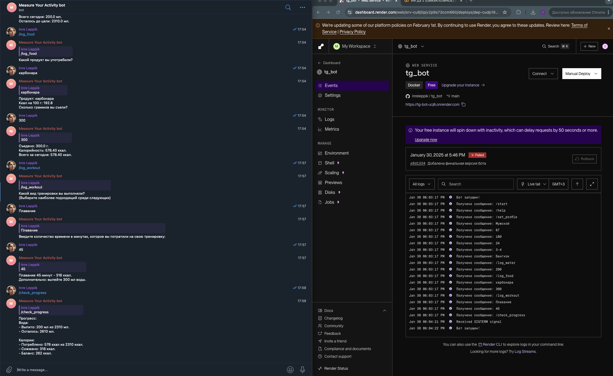

